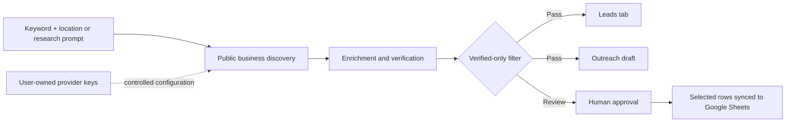

> **Editorial note:** This guide is written for agencies, freelancers, local growth teams, real-estate teams, founders, and developers who need a practical way to research public business prospects. It explains a workflow—not a promise of guaranteed contact accuracy, search rankings, conversions, or outreach results.

## What is Google Maps lead generation to Google Sheets?

Google Maps lead generation to Google Sheets is the process of turning a focused search—such as a business category plus a city—into a structured prospect list that can be reviewed and organized in a spreadsheet. Instead of copying business names, phone numbers, websites, and other public details by hand, a purpose-built workflow can discover candidate businesses, verify the available public contact signals, and place the usable records into a Google Sheet.

The important distinction is between **discovery** and **verification**. A business appearing in a local search does not automatically mean that it has a usable phone number, a public email signal, a relevant website, or a genuine fit for your offer. A higher-quality process separates those stages, filters out incomplete records, and leaves the final decision to a human operator.

NexusLeads is designed around that sequence. Its public product page describes a workflow that turns a keyword and location into public business data, social profiles, and personalized email or WhatsApp drafts, then organizes the output in separate **Leads** and **Outreach** tabs in Google Sheets. The site also states that the workflow uses Google Places discovery, verifies public details, and supports a verified-only filter when both a public phone number and email are required.[1]

## Why direct Google Sheets delivery matters

For many small teams, Google Sheets is not merely an export destination. It is the working surface where a campaign is reviewed, assigned, filtered, annotated, and handed to another person. A CSV download adds another step: download the file, inspect the columns, upload it, remove duplicates, create outreach fields, and decide which rows are ready for contact.

A direct Google Sheets workflow reduces that friction. It also makes the boundary between research and outreach more visible. One tab can hold the verified lead record, while a second tab can hold a draft message, a proposed angle, and the next action. That separation helps a team avoid treating every discovered business as an approved contact.

| Workflow stage | What happens | Quality control question |
|---|---|---|
| Define the target | Enter a keyword, location, or research prompt | Is the market narrow enough to produce a relevant list? |
| Discover candidates | Find public businesses matching the query | Does the result fit the business category and location? |
| Verify public details | Check available phone, email, website, and social signals | Which fields are actually public and usable? |
| Prepare outreach | Generate a context-aware draft for review | Is the message relevant, accurate, and respectful? |
| Export and organize | Sync selected records to Leads and Outreach tabs | Has a human reviewed the rows before contact? |

## The NexusLeads method: from a search idea to an outreach-ready list

A reliable local prospecting workflow should be understandable enough that another person can audit it. NexusLeads presents the process as four steps: describe the target, discover candidates, verify public details, and reach out with context.[1]

### 1. Describe the target with a keyword and location

Start with a specific market rather than a vague request. “Businesses in London” is too broad for most campaigns. “Independent restaurants in London with a public website and signs of weak local SEO” is more useful because it describes a category, a geography, and an observable business need.

A strong query usually contains four elements:

| Element | Example | Why it helps |
|---|---|---|
| Business type | Independent restaurants | Defines the prospect category |
| Location | London | Defines the service area |
| Public signal | Website, phone, email, or social link | Sets a verification requirement |
| Opportunity angle | Local SEO, website improvement, paid media, or branding | Gives outreach a reason to exist |

This structure is useful for agencies and freelancers because it connects the lead list to a service offer. It is also helpful for developers building a repeatable workflow because the query can be stored as an input and reused across campaigns.

### 2. Discover candidate businesses

The discovery stage should expand the candidate pool without pretending that every result is qualified. NexusLeads states that it uses Google Places discovery and processes enrichment in small batches. The public page describes safe five-lead enrichment batches and a target of 20–50 leads per search.[1]

A smaller batch approach can be useful operationally. It makes it easier to identify a bad query, review the returned fields, and correct the workflow before spending time on a large campaign. It also encourages a research mindset rather than an indiscriminate “collect everything” mindset.

### 3. Verify public details

Verification is where a generic Google Maps scraper becomes a more useful lead-generation workflow. A verified-only filter should be understood precisely: it does not mean that a business is guaranteed to buy, that an email address is guaranteed to deliver, or that every public field is current. It means the workflow applies a defined condition to the public data it can check.

NexusLeads says that its verified-only mode can require both a public phone number and email. The site also says that it collects public business information such as business name, category, address, website, rating, public phone numbers, public email signals, and public social links, and that it does not access private account data.[1]

For responsible prospecting, keep these distinctions clear:

> **Public does not mean personal, permanent, or permission to send anything.** Public business information should be used carefully, with accurate personalization, appropriate contact practices, and respect for applicable law and platform terms.

### 4. Prepare outreach with context

The best lead list is not necessarily the largest one. It is the list where a sales or agency team can explain why each row is relevant. NexusLeads describes outreach drafts for email and WhatsApp and provides 11 outreach skills on its public product page.[1]

A draft should be treated as a starting point for human editing. It should reference an observable business context—such as an outdated website, a missing service page, a weak local presence, or a relevant partnership opportunity—without inventing facts. The operator should be able to remove a row, edit the message, or decide not to contact the business.

## Use case 1: Agency owners building a repeatable prospecting lane

An SEO, web-design, paid-media, or growth agency often needs a steady way to identify businesses that may benefit from a service. The challenge is not simply finding company names. The challenge is creating a repeatable process that a founder, salesperson, or assistant can run without lowering the agency’s quality standard.

Consider a web agency searching for independent restaurants in a defined city. The operator can specify the category and location, require public contact signals, review the websites, and use the Leads tab for factual records. The Outreach tab can hold a draft that mentions a specific business opportunity, such as a confusing mobile navigation structure or an unclear reservation path—but only if the reviewer has actually observed it.

The agency benefit is operational consistency. Each search can use the same fields, the same verification rule, and the same review process. That makes it easier to compare campaigns and train a new team member without handing over an opaque spreadsheet.

**Recommended landing-page angle:** “Build a verified local prospecting lane for your agency—then send only the rows you approve to Google Sheets.”

## Use case 2: Freelancers finding businesses with a visible opportunity

A freelancer may not need a large database. They may need ten relevant businesses in a service area where a focused offer makes sense. For example, a freelance designer could search for local professional firms with a public website and then review whether the websites clearly explain services, location, and contact options.

The key is to avoid generic outreach. A freelancer should not send the same “I can improve your website” message to every row. Instead, the workflow can help create a shortlist, while the freelancer manually confirms the opportunity and writes a respectful, specific message.

**Recommended landing-page angle:** “Find a smaller list of businesses you can genuinely help, with public details organized for a human review.”

## Use case 3: Local growth teams mapping a service area

A local marketing team may need to map businesses across several neighborhoods or towns. Google Sheets is useful here because the team can sort by location, category, website status, or review notes. A dedicated Leads tab can remain factual, while the Outreach tab can track the campaign angle and status.

A practical process is to begin with one neighborhood, check the quality of the returned data, and then expand to adjacent areas. This is more defensible than launching a broad search and discovering later that the list contains duplicate, irrelevant, or incomplete rows.

**Recommended landing-page angle:** “Turn service-area research into an organized local campaign without losing track of which businesses were actually verified.”

## Use case 4: Real-estate and property-service teams expanding territory

Real-estate teams, brokers, property managers, contractors, and related service businesses often operate by geography. A territory-based lead workflow can help identify brokerages, property services, renovation companies, photographers, mortgage professionals, or other businesses that may be relevant to a partnership or referral strategy.

The outreach must be especially context-aware. A partnership message should explain the relationship being proposed and why the business appears relevant. It should not imply an existing relationship, invent a listing, or create urgency that is not real.

**Recommended landing-page angle:** “Research territory-based business opportunities and prepare location-aware outreach drafts for review.”

## Use case 5: Developers and technical founders using BYOK

BYOK means **Bring Your Own Keys**: the user supplies supported provider credentials and pays those provider costs directly, while the platform may charge a separate platform fee. NexusLeads states that its BYOK options allow users to use their own Google Maps, Gemini, and enrichment keys, with provider charges billed separately.[1]

This model can be useful for teams that want clearer control over provider billing or want to avoid placing every provider credential into a shared platform account. It also creates an obligation: the product must explain which keys are required, what each key is used for, what permissions are needed, and how the user can revoke or rotate access.

A developer-oriented NexusLeads page should include a simple architecture diagram:



The phrase **stateless lead generation API** should not be used as a vague trust signal. If the product claims stateless behavior, the technical documentation should define what is and is not retained, how jobs are identified, how errors are handled, and whether any logs or temporary files exist.

## How to create better prompts for local-business lead research

The prompt should define the market, the location, the required public fields, and the qualification signal. A useful prompt is specific without assuming facts that have not been verified.

### Prompt template for agencies

> Find independent [BUSINESS TYPE] in [CITY or REGION] with a public website, public phone number, and public email signal. Return business name, category, address, website, public contact details, and a short note about observable opportunities related to [SERVICE]. Keep only records that meet the verification rule.

### Prompt template for partnerships

> Find freelancers and small agencies in [CITY] offering [SERVICE] who may be relevant for a delivery partnership. Return only public business details and explain the partnership relevance without inventing company facts.

### Prompt template for local campaigns

> Find [BUSINESS TYPE] in [LOCATION] with public contact details and a visible need related to [CAMPAIGN GOAL]. Organize verified records for review and prepare concise outreach drafts that reference only observable information.

## How NexusLeads compares with common alternatives

The goal of a comparison is not to declare one universal winner. It is to explain which workflow fits which job.

| Tool or category | Core orientation | Typical output or workflow | Where NexusLeads is differentiated |
|---|---|---|---|
| ParseHub | Broad no-code web scraping and interactive extraction | JSON, Excel, API, and other data workflows | NexusLeads is more narrowly focused on verified public business research, outreach drafts, and Google Sheets organization. ParseHub’s official page emphasizes clicking to select data, interactive pages, APIs, schedules, and cloud collection.[2] |
| Apollo | B2B contact database, lead scoring, intent, and sales engagement | Contact search, sequences, CRM sync, and outreach | NexusLeads is oriented toward user-directed local business discovery and public-data verification rather than a large contact database. Apollo’s official product page emphasizes database filters, scoring, intent, sequences, and CRM integrations.[3] |
| Instant Data Scraper | Browser extension for no-code extraction | Excel or CSV export from detected tables and lists | NexusLeads adds a structured lead workflow, verified-only filtering, outreach drafts, and direct Leads/Outreach Sheet tabs. The Chrome Web Store listing describes Instant Data Scraper’s browser-local extraction and Excel/CSV export.[4] |
| Workflow automation tools | Flexible orchestration | User-built nodes and integrations | NexusLeads packages a focused research-to-outreach workflow for teams that want less setup and more product guidance. |

## What makes a lead list trustworthy?

Trust is not created by a badge or a large row count. It is built through transparent process details. A trustworthy lead workflow should make the following visible:

1. **Source scope:** Explain whether the workflow uses public business information, user-provided data, or private account data. NexusLeads states that it uses public business information and does not access private account data.[1]
2. **Verification rule:** Define what “verified” means for the product. NexusLeads describes a verified-only option based on public phone and email availability.[1]
3. **Human review:** Make clear that drafts are reviewed before sending. NexusLeads states that it prepares drafts and does not automatically send emails or WhatsApp messages.[1]
4. **User control:** Explain whether users can select individual rows and disable automatic push. NexusLeads says users can turn Auto-Push off and use Sync Selected.[1]
5. **Credential handling:** Describe BYOK requirements, provider billing, access scopes, and key rotation. Do not promise security properties that have not been documented and tested.
6. **Limitations:** State that public data can be incomplete, outdated, duplicated, or unavailable for some businesses.

## E-E-A-T signals for this article and product page

Google’s structured-data documentation says that Organization markup can help Google understand an organization’s administrative details and disambiguate it from other organizations. Google also recommends validating structured data and using the URL Inspection tool after deployment.[5] Structured data does not replace strong content or prove expertise by itself, so the page should combine markup with visible evidence.

For NexusLeads, the most credible E-E-A-T implementation is practical and verifiable:

| Signal | Recommended implementation |
|---|---|
| Experience | Add a short “How this workflow was built and tested” section with screenshots or a live dashboard link, provided the screenshots represent the current product. |
| Expertise | Name the author and link to the founder’s profile and verified project portfolio. The founder page identifies Sayad Md Bayezid Hosan and links to the live lead-collection project.[6] |
| Authoritativeness | Link to product documentation, privacy policy, support, and the live dashboard. Avoid unsupported claims such as “best” or “most accurate.” |
| Trustworthiness | State what data is collected, what is not accessed, how drafts work, how BYOK billing works, and how users control Sheet sync. |
| Editorial transparency | Add a publication date, last-reviewed date, author bio, correction policy, and clear disclosure that the article describes the NexusLeads product. |

> **Author bio recommendation:** “Written by Sayad Md Bayezid Hosan, founder and builder of SmartGen tools. Bayezid maintains the NexusLeads lead-collection workflow and publishes links to live projects and verified profiles so readers can inspect the work directly.”

## Recommended Organization, Tool, and FAQ structured data

Place structured data only when the visible page contains the same information. Google states that structured data should describe the content on the page, and it recommends validation with the Rich Results Test.[5] Google’s SoftwareApplication documentation requires a name and offer price for supported software-app rich results, and it requires a rating or review when seeking eligibility for that rich-result type.[7] Because the public NexusLeads page does not provide an independent aggregate rating in the reviewed content, the example below intentionally omits `aggregateRating` and `review` rather than inventing either.

The following JSON-LD is a starting point. Replace the image URL, logo URL, dates, and any pricing fields if the article is published on a different URL or the product details change.

```html
<script type="application/ld+json">
{
  "@context": "https://schema.org",
  "@graph": [
    {
      "@type": "Organization",
      "@id": "https://leads.sayadbayezid.com/#organization",
      "name": "NexusLeads",
      "alternateName": "SmartGen NexusLeads",
      "url": "https://leads.sayadbayezid.com/",
      "description": "A lead-research workflow for discovering public business data, verifying contact signals, preparing outreach drafts, and organizing selected records in Google Sheets.",
      "email": "support@sayadbayezid.com",
      "founder": {
        "@type": "Person",
        "name": "Sayad Md Bayezid Hosan",
        "url": "https://sayadbayezid.com/"
      },
      "sameAs": [
        "https://sayadbayezid.com/",
        "https://smartgentools.com/"
      ]
    },
    {
      "@type": "SoftwareApplication",
      "@id": "https://leads.sayadbayezid.com/#software",
      "name": "NexusLeads",
      "url": "https://leads.sayadbayezid.com/",
      "applicationCategory": "BusinessApplication",
      "operatingSystem": "Web",
      "description": "A privacy-conscious lead research and outreach-draft tool that organizes verified public business details in Google Sheets.",
      "provider": {
        "@id": "https://leads.sayadbayezid.com/#organization"
      },
      "offers": {
        "@type": "Offer",
        "price": "0",
        "priceCurrency": "USD",
        "description": "Free tier available; paid BYOK and managed options may apply. Confirm current pricing on the live product page."
      },
      "featureList": [
        "Keyword and location research",
        "Public business detail verification",
        "Verified-only filtering",
        "Leads and Outreach Google Sheets tabs",
        "Email and WhatsApp draft preparation",
        "Manual or selected-row Sheet synchronization",
        "Bring Your Own Keys option"
      ]
    },
    {
      "@type": "Article",
      "@id": "https://leads.sayadbayezid.com/google-maps-lead-generation-google-sheets/#article",
      "headline": "Google Maps Lead Generation to Google Sheets: A Privacy-First Workflow for Verified Local Prospects",
      "description": "A practical guide to discovering public local-business prospects, verifying contact signals, preparing outreach drafts, and organizing selected leads in Google Sheets.",
      "author": {
        "@type": "Person",
        "name": "Sayad Md Bayezid Hosan",
        "url": "https://sayadbayezid.com/"
      },
      "publisher": {
        "@id": "https://leads.sayadbayezid.com/#organization"
      },
      "mainEntityOfPage": "https://leads.sayadbayezid.com/google-maps-lead-generation-google-sheets/",
      "datePublished": "2026-09-07",
      "dateModified": "2026-09-07"
    },
    {
      "@type": "FAQPage",
      "@id": "https://leads.sayadbayezid.com/google-maps-lead-generation-google-sheets/#faq",
      "mainEntity": [
        {
          "@type": "Question",
          "name": "What does a Google Maps lead-generation workflow do?",
          "acceptedAnswer": {
            "@type": "Answer",
            "text": "It turns a focused keyword and location into a list of public business records, applies a defined verification rule, and organizes selected records for review or Google Sheets delivery."
          }
        },
        {
          "@type": "Question",
          "name": "Does NexusLeads access private account data?",
          "acceptedAnswer": {
            "@type": "Answer",
            "text": "The NexusLeads product page states that the tool searches public business information and does not access private account data."
          }
        },
        {
          "@type": "Question",
          "name": "Does NexusLeads send emails or WhatsApp messages automatically?",
          "acceptedAnswer": {
            "@type": "Answer",
            "text": "No. The product page states that NexusLeads prepares drafts for review and leaves the selection, editing, and sending decision to the user."
          }
        },
        {
          "@type": "Question",
          "name": "What does BYOK mean in NexusLeads?",
          "acceptedAnswer": {
            "@type": "Answer",
            "text": "BYOK means Bring Your Own Keys. NexusLeads states that users can configure their own supported provider keys, while provider charges are billed separately by those providers."
          }
        },
        {
          "@type": "Question",
          "name": "Can I choose which leads go to Google Sheets?",
          "acceptedAnswer": {
            "@type": "Answer",
            "text": "The NexusLeads product page states that users can turn Auto-Push off, review returned leads, select the rows they want, and use Sync Selected."
          }
        }
      ]
    }
  ]
}
</script>
```

FAQ markup should not be treated as a guarantee of a Google FAQ rich result. Google’s Search Central documentation explains how structured data is interpreted and validated, but search appearance is not guaranteed.[5] The visible questions and answers remain valuable because they address buyer objections and improve the page’s usefulness.

## Frequently asked questions

### Is NexusLeads a Google Maps scraper?

NexusLeads is positioned on its public page as a lead-research workflow that uses Google Places discovery, public business information, verification, outreach drafts, and Google Sheets organization. The product page specifically states that discovery runs against Google’s Places API rather than scraping.[1] The safest description is therefore a **public business lead-research and verification workflow**, not a generic scraping product.

### What information can the workflow collect?

The public product page lists business name, category, address, website, rating, public phone numbers, public email signals, and public social links.[1] Availability depends on the business, the source, the query, and the verification process. A blank field should remain blank or be marked unavailable rather than filled with an assumption.

### Does “verified-only” mean every lead will convert?

No. Verification is a data-quality condition, not a buying-intent guarantee. A verified public phone number or email signal does not establish that the business is interested, that the contact is the decision-maker, or that outreach will be successful.

### Can I review leads before sending them to Google Sheets?

The product page states that Auto-Push can be turned off so users can review returned leads, select the rows they want, and use Sync Selected.[1] This is an important control for teams that want a human approval step.

### Does NexusLeads automatically send outreach?

The product page states that NexusLeads prepares email and WhatsApp drafts but does not automatically send them. The user decides which leads to select, what to edit, and when to contact someone.[1]

### What is the best keyword for this workflow?

The strongest primary keyword for a dedicated landing page is **Google Maps lead generation to Google Sheets**. Supporting long-tail terms include **auto push Google Maps leads to Google Sheets**, **Google Maps lead scraper Google Sheets**, **local business leads spreadsheet**, **privacy-first lead generation tool**, and **BYOK lead generation API**. Search-volume values for these exact worldwide phrases should be checked in an SEO platform before being published as numeric claims.

## Final checklist before publishing

| Check | Action |
|---|---|
| Search intent | Keep the page focused on the source-to-destination workflow, not generic scraping education. |
| Product truth | Recheck pricing, limits, provider names, and feature counts before publication. |
| E-E-A-T | Add the author name, founder link, live product link, support contact, and editorial review date. |
| Compliance | Add a clear public-data scope, human-review statement, and responsible outreach note. |
| Structured data | Validate JSON-LD with Google’s Rich Results Test and ensure every marked claim is visible on the page.[5] |
| Internal links | Link to the dashboard, pricing, prompt library, FAQ, privacy policy, support, and founder page. |
| Conversion | Use one primary CTA such as “Try NexusLeads free” and a secondary CTA such as “See how the workflow works.” |
| Measurement | Track clicks to the live dashboard, account starts, completed searches, selected-row syncs, and qualified human-reviewed leads. |

## Conclusion

The most valuable Google Maps lead-generation workflow is not the one that produces the most rows. It is the one that helps a team define a useful market, discover relevant public businesses, verify the signals that matter, prepare context-aware drafts, and keep the final decision under human control.

NexusLeads has a clear opportunity to own that position: **privacy-conscious local lead research, verified public business data, direct Google Sheets organization, and user-controlled outreach preparation**. By focusing the page on the exact job to be done—moving a keyword and location into a clean, reviewable lead workflow—SmartGen can attract agencies, freelancers, local growth teams, real-estate teams, and developers who need a practical alternative to broad scraping tools, large sales databases, or file-only browser extensions.

[1]: https://leads.sayadbayezid.com/ "NexusLeads official product page"
[2]: https://www.parsehub.com/ "ParseHub official web-scraping product page"
[3]: https://www.apollo.io/product/lead-generation "Apollo official B2B lead-generation product page"
[4]: https://chromewebstore.google.com/detail/instant-data-scraper/ofaokhiedipichpaobibbnahnkdoiiah?hl=en-US "Instant Data Scraper official Chrome Web Store listing"
[5]: https://developers.google.com/search/docs/appearance/structured-data/organization "Google Search Central Organization structured data documentation"
[6]: https://sayadbayezid.com/ "Sayad Md Bayezid Hosan official founder and project portfolio page"
[7]: https://developers.google.com/search/docs/appearance/structured-data/software-app "Google Search Central SoftwareApplication structured data documentation"
